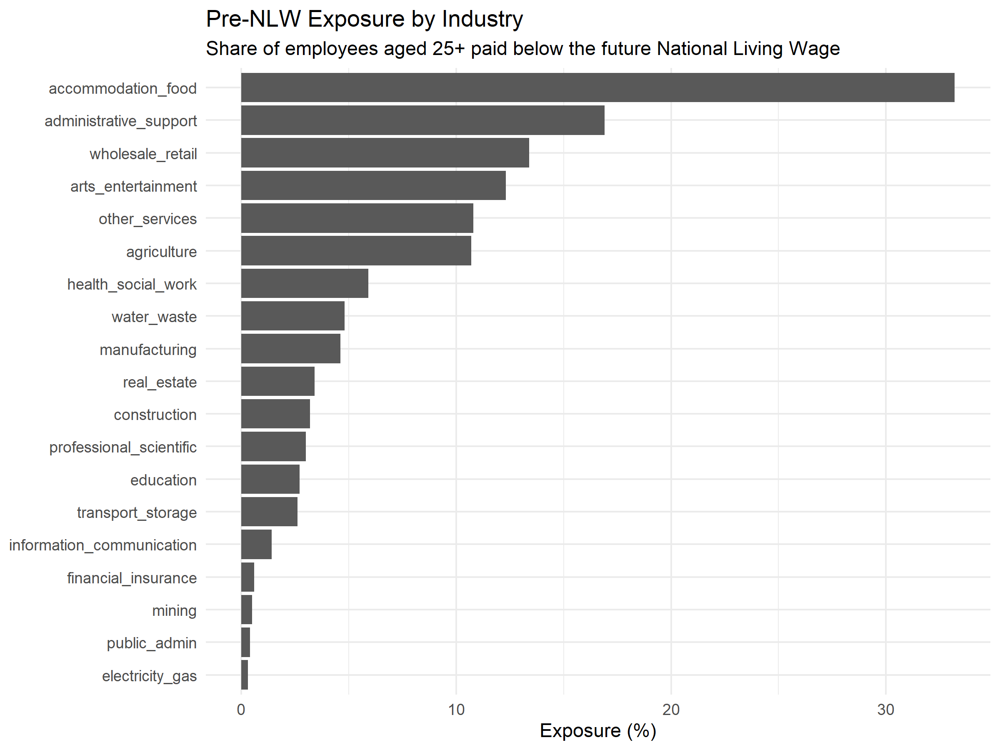
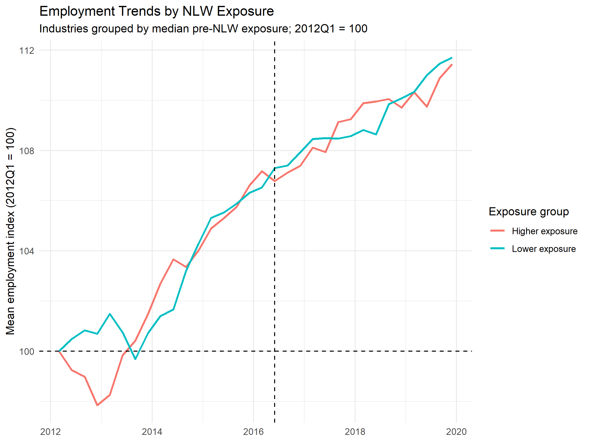
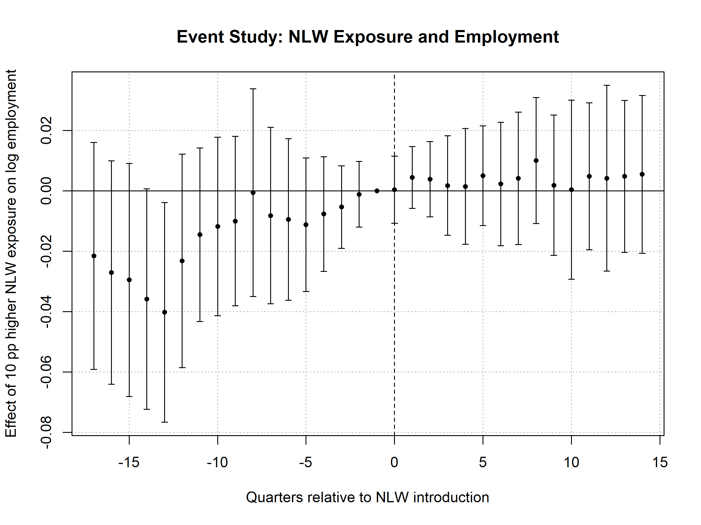
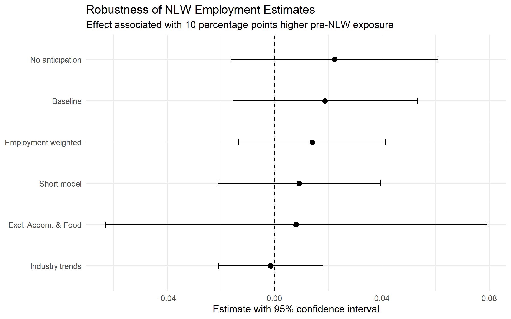

# UK National Living Wage and Employment

## Overview

This project examines whether the introduction of the UK National Living Wage (NLW) in April 2016 was associated with changes in employment across industries with different levels of exposure to the new wage floor.

The analysis uses a quarterly panel of 19 UK industries from 2012Q1 to 2019Q4. Exposure to the policy is measured as the pre-NLW share of employees aged 25+ earning below the future NLW.

The empirical strategy combines two-way fixed-effects regressions, an event study, and robustness checks. Overall, the results provide no robust evidence that greater exposure to the NLW reduced industry-level employment. However, differences in pre-treatment employment trends limit a strong causal interpretation of the baseline estimates.

## Research Question

**Did industries more exposed to the introduction of the National Living Wage experience different employment changes after April 2016?**

Rather than dividing industries into treated and untreated groups, the analysis uses differences in the intensity of exposure to the policy.

## Data

The final panel contains:

- 19 industries
- 32 quarters from 2012Q1 to 2019Q4
- 608 industry-quarter observations
- seasonally adjusted employee jobs
- pre-NLW exposure measured as the percentage of employees aged 25+ paid below the future NLW

Exposure varies substantially across industries. Accommodation & Food is the most exposed industry at approximately 33.2%, compared with a median exposure of 3.4%.

## Descriptive Evidence

For descriptive purposes, industries are divided at the median level of exposure and employment is indexed to 2012Q1 = 100.

Both groups experienced substantial employment growth. However, pre-treatment employment growth is positively related to NLW exposure, including after Accommodation & Food is excluded. This suggests that industries were already following somewhat different employment trajectories before the policy.

## Empirical Strategy

The baseline specification is:

`log(employment_it) = β(Exposure_i × Post_t) + Industry FE + Quarter FE + ε_it`

Exposure is scaled so that one unit represents a 10 percentage point increase in pre-NLW exposure. Industry fixed effects control for time-invariant industry differences, while quarter fixed effects absorb aggregate shocks. Standard errors are clustered at the industry level.

The coefficient β measures the differential post-2016 employment change associated with 10 percentage points higher pre-NLW exposure.

## Main Results

The baseline estimate is 0.0188, corresponding to an approximately 1.9% larger post-2016 employment change for an industry with 10 percentage points higher pre-NLW exposure. However, the estimate is statistically insignificant and its confidence interval includes both negative and positive effects.

| Specification | Estimate | 95% CI | p-value |
|---|---:|---:|---:|
| Baseline | 0.0188 | [-0.0155, 0.0531] | 0.265 |
| Short window | 0.0092 | [-0.0210, 0.0394] | 0.530 |
| Excl. Accommodation & Food | 0.0080 | [-0.0631, 0.0791] | 0.815 |
| Industry trends | -0.0014 | [-0.0209, 0.0180] | 0.879 |
| Employment weighted | 0.0140 | [-0.0134, 0.0414] | 0.297 |
| No anticipation | 0.0224 | [-0.0162, 0.0609] | 0.239 |

None of the specifications provide statistically significant evidence of a negative employment effect. Most notably, allowing for industry-specific linear trends reduces the estimate to approximately zero.

## Event Study and Pre-Trends

The event study allows the relationship between exposure and employment to vary by quarter around the introduction of the NLW.

Post-treatment estimates remain close to zero and their confidence intervals consistently include zero.

Earlier pre-treatment coefficients are predominantly negative before converging towards zero closer to the policy introduction. A joint Wald test also rejects joint nullity of the pre-treatment coefficients. Because this test involves 16 restrictions with only 19 industry clusters, its exact inference should be treated cautiously.

Together with the descriptive evidence and sensitivity to industry trends, the event study raises concerns about differential pre-treatment trajectories. The baseline estimate is therefore not interpreted as a clean causal effect.

## Robustness

The main conclusion is unchanged when the sample window is shortened, Accommodation & Food is excluded, industries are employment-weighted, industry-specific linear trends are included, or the potential anticipation period is removed.

With only 19 industry clusters, conventional cluster-robust inference may be unreliable. A wild cluster bootstrap with 9,999 replications gives a p-value of 0.412 and a 95% confidence interval of [-0.0666, 0.0847] for the baseline estimate.

The wider interval reinforces the substantial uncertainty around the estimated effect.

### Anticipation

The NLW was announced in July 2015, around nine months before its introduction in April 2016. Employers may therefore have adjusted before the policy formally took effect.

Excluding 2015Q3–2016Q1 produces an estimate of 0.0224, which remains statistically insignificant. The conclusion is therefore not sensitive to removing this plausible anticipation period.

## Interpretation and Policy Implications

Overall, the results provide no robust evidence that industries with greater exposure to the NLW experienced lower employment after its introduction.

This does not imply that the true employment effect was exactly zero. The confidence intervals include both negative and positive effects, particularly when small-cluster inference is taken into account.

The findings are broadly consistent with existing UK research, although direct comparison is limited by differences in data and level of aggregation. Aitken, Dolton and Riley (2018), using worker-level data, find that the introduction of the NLW substantially increased wages for low-paid workers while having generally limited adverse effects on employment retention.

From a policy perspective, the results suggest that the introduction of the NLW was not followed by an obvious industry-level employment contraction in more exposed sectors. At the same time, the analysis demonstrates the importance of pre-existing trends and statistical uncertainty when evaluating minimum-wage policies.

## Limitations

- Identification relies on only 19 industries, leaving relatively few independent units for inference.
- Pre-treatment employment trajectories differ across industries, weakening the parallel-trends assumption.
- Industry-level employment may miss adjustment through hours, prices, productivity, profits or worker composition.
- Industry-level exposure masks differences between firms and workers within industries.
- The NLW initially applied only to workers aged 25+, so aggregate industry data cannot identify substitution between workers above and below the age threshold.

A potential extension would be to examine whether the NLW changed relative employment outcomes for workers above and below the original age threshold.

## Conclusion

The baseline model finds a small positive but statistically insignificant relationship between NLW exposure and post-2016 employment. The estimate falls to approximately zero when industry-specific trends are included, while the event study raises concerns about differential pre-treatment trajectories.

Overall, the analysis finds no robust evidence of an adverse industry-level employment effect from greater exposure to the NLW, but the available data do not support a precise causal estimate.

More broadly, the project shows how conclusions from a simple policy comparison can become less clear once pre-trends, robustness checks and small-cluster inference are taken seriously.

## Repository Structure

- `data/raw/` — original ONS employment and NLW exposure data
- `data/processed/` — cleaned industry-quarter panel used in the analysis
- `R/` — data cleaning, descriptive analysis, causal models, event study and robustness scripts
- `figures/` — figures produced by the analysis
- `tables/` — regression and summary tables

## References

- Aitken, A., Dolton, P. and Riley, R. (2018) *The Impact of the Introduction of the National Living Wage on Employment, Hours and Wages*. London: Low Pay Commission.